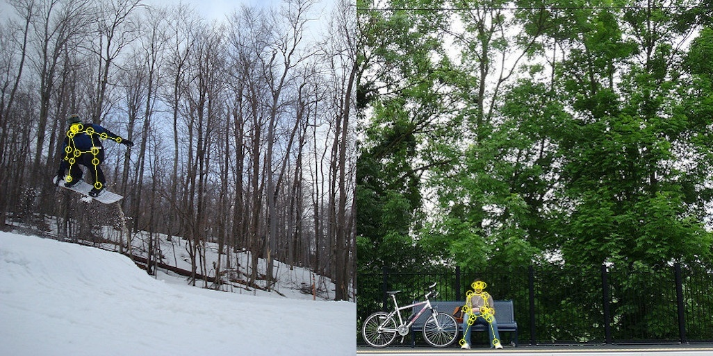

# Pose Estimation

This repository contains the source code for neural networks used in human body pose
estimation. 

The neural networks are built off of the tensorflow.js [PoseNet](https://github.com/tensorflow/tfjs-models/tree/master/posenet) model, 
and the repository is configured as such. The model is then converted to a format usable by PyTorch, and used as such.

## Structure

The system functions in three stages: 
1. Download the relevant weight files for the tensorflow.js PoseNet model and format them into the `data/weights` directory.
2. Create the PyTorch MobileNet v1 model in the `architecture` directory, then convert and load the PoseNet weight files into the MobileNet v1 model.
3. Decode the outputs of the model using methods in the `decode.py` script.
4. Finally, draw the keypoints and pose skeleton onto the image using the `util/draw_utils.py` script.

## Credits

The model output decoding and keypoint/skeleton drawing was loosely based off of Ross Wightman's similar inplementation
of PoseNet into PyTorch, accessible [here](https://github.com/rwightman/posenet-python).

